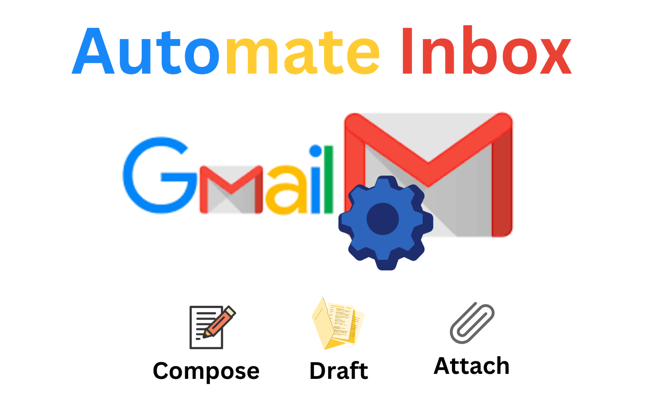

# 📬 Email Agent – Automate Your Inbox with Intelligence

Email overload is real. Professionals waste hours triaging, replying, and composing emails — time that should be spent on actual work. Email Agent solves this.

💡 Why Email Agent?
Your inbox is a battlefield of important messages, junk, follow-ups, and repetitive replies.
Manually handling each email is time-consuming, error-prone, and mentally exhausting.

Email Agent is an intelligent assistant that:

🧠 Understands email context using LLMs

✍️ Replies, summarizes, and drafts emails for you

📅 Will soon schedule meetings using Google Calendar

⏱️ Works in real time or on a schedule

🛠️ Offers a chat interface via Chainlit

🚨  API endpoint comming soon!

This isn’t a template-filler or a canned auto-responder. It’s an agent with reasoning, memory (via Supabase), and tool orchestration.

🔥 What Can It Do?
Fetch Latest Emails from Gmail
Pulls the most recent and relevant messages directly from your inbox.

Summarize Conversations
Returns human-readable summaries of long threads using OpenAI.

Smart Replies
Understands the context and replies accordingly with proper tone and thread metadata.

Draft Emails
You just give intent like "follow up on invoice," and it writes the draft.

Categorize Emails
Sorts emails by urgency, topic, or department using your own rules or AI logic.

Scheduled Automation
Run tasks periodically (every 30s, 10min, etc.).

Chat with Your Inbox
Using Chainlit, talk to your inbox: "Send email to Joe about the project deadline."

## 📝 How to Use

1. Clone the repo
2. Install dependencies
3. Run `main.py` via 'streamlit run main.py'

## 📝 Setup Gmail API
Go to Google Cloud Console
Enable Gmail API
Create OAuth 2.0 credentials
Download credentials.json and place it in the project root.

<pre>
Email-Agent/
│
├── models/
│   ├── __init__.py
│   └── interfaces.py         # Pydantic interfaces for request/response models and type safety
│
├── tools/
│   ├── __init__.py
│   ├── process_pipeline.py   # Logic for processing and categorizing incoming emails
│   ├── draft_pipeline.py     # Pipeline for generating email drafts
│   ├── compose_pipeline.py   # Builds new email content from scratch
│   ├── summarizer.py         # Summarizes email threads or individual emails
│   └── reply_generator.py    # Generates intelligent reply suggestions
│
├── services/
│   ├── __init__.py
│   └── auth.py               # OAuth2 Gmail authentication and token management
│
├── email_agents/
│   ├── __init__.py
│   ├── email_agent.py        # Core OpenAI agent logic for handling instructions and tools
│   └── instructions.py       # System prompts and behavioral guidelines for the agent
│
├── fetcher.py                # Fetches and parses emails from Gmail
├── email_builder.py          # Assembles MIME-formatted messages
├── replier.py                # Encodes and sends replies to Gmail
├── drafter.py                # Handles the logic for building drafts with context
├── composer.py               # Constructs original emails from user intent
├── processor.py              # Central entry point for orchestrating the pipelines
├── categorizer.py            # Classifies emails by type (e.g., important, promotional)
├── main.py                   # Chainlit UI entry point for live chat interaction
</pre>

🧠 Future Roadmap

✅ Google Calendar API Integration

✅ Supabase DB for agent memory and user history

🔐 Multi-user auth system (Google Sign-in / Clerk)

🧾 Attachment summarization

📣 Notification system (email / push)

📊 Daily digest reports (via email)

<pre>
👨‍💻 Author
Built by Taha Siraj – AI Agent Developer & Full-stack Engineer
💼 Portfolio: (https://my-portfolio-eta-one-97.vercel.app/)
🔗 GitHub: (https://github.com/Tahasiraj1)
</pre># Cold-OutReach-Assistant
